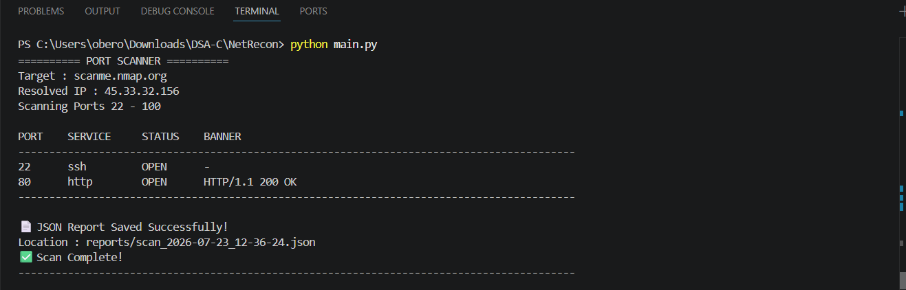
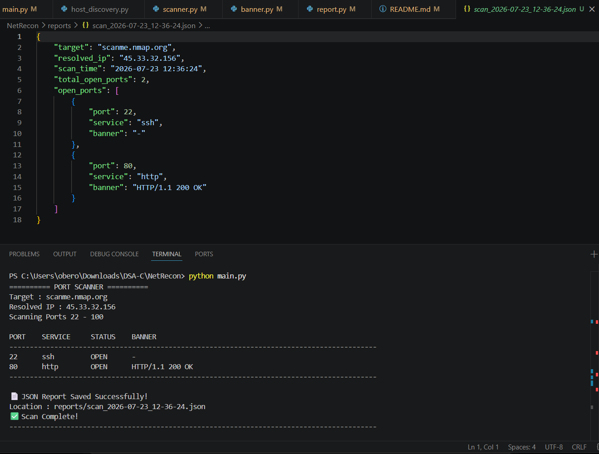

# 🛡️ NetRecon

A modular Python-based Network Reconnaissance Tool developed to strengthen my understanding of networking, socket programming, and cybersecurity concepts by implementing core reconnaissance techniques from scratch.

---

# 📌 Current Version

**NetRecon v1.6**

---

# 🚀 Features

- ✅ Host Discovery
- ✅ DNS Hostname Resolution
- ✅ TCP Port Scanning
- ✅ Service Detection
- ✅ Multithreaded Scanning
- ✅ HTTP Banner Grabbing
- ✅ JSON Report Generation

---

# 📂 Project Structure

```
NetRecon/
│
├── banner.py              # HTTP banner grabbing
├── host_discovery.py      # Host discovery using ping
├── main.py                # Main application
├── report.py              # JSON report generation
├── scanner.py             # Multithreaded TCP port scanner
├── utils.py               # DNS hostname resolution
│
├── reports/               # Generated scan reports
│
├── requirements.txt
├── README.md
└── .gitignore
```

---

# ⚙️ Technologies Used

- Python 3
- Socket Programming
- ThreadPoolExecutor
- JSON
- DNS Resolution
- TCP Networking

---

# ▶️ Installation

Clone the repository

```bash
git clone https://github.com/AmitojOberoi/NetRecon.git
```

Move into the project directory

```bash
cd NetRecon
```

Run the application

```bash
python main.py
```

---

# 🖥️ Usage

Launch the application.

```
========== NETRECON ==========

1. Host Discovery
2. Port Scanner
3. Exit
```

Example:

```
Enter Target : scanme.nmap.org

Resolved IP : 45.33.32.156

Scanning Ports 20 - 100
```

Example Output

```
PORT      SERVICE      STATUS      BANNER

22        ssh          OPEN        -
80        http         OPEN        HTTP/1.1 200 OK
```

---

# 📄 JSON Report Generation

Every scan automatically generates a timestamped JSON report.

Example:

```
reports/

scan_2026-07-23_12-31-41.json
```

Example JSON

```json
{
    "target": "scanme.nmap.org",
    "resolved_ip": "45.33.32.156",
    "scan_time": "2026-07-23 12:31:41",
    "total_open_ports": 2,
    "open_ports": [
        {
            "port": 22,
            "service": "ssh",
            "banner": "-"
        },
        {
            "port": 80,
            "service": "http",
            "banner": "HTTP/1.1 200 OK"
        }
    ]
}
```

---

# 📸 Screenshots

### Port Scanner

> 

### Generated JSON Report

> 

---

# 🛣️ Roadmap

## Version 1.7

- Scan Statistics
- CSV Report Export

## Version 1.8

- Improved Banner Grabbing
- Better HTTP Detection

## Version 1.9

- Nmap Integration

## Version 2.0

- HTML Report Generation
- Rich Terminal Interface
- Scan History
- OS Detection

---

# 📖 What I Learned

This project helped me gain practical experience with:

- Socket Programming
- TCP Connections
- DNS Resolution
- Port Scanning
- Banner Grabbing
- Multithreading
- JSON File Handling
- Modular Python Project Design

---

# 💡 Inspiration

This project was inspired by the networking and reconnaissance concepts I explored during my cybersecurity internship. Instead of relying solely on existing tools, I wanted to understand how common reconnaissance techniques work by implementing them myself in Python.

---

# 👨‍💻 Author

**Amitoj Oberoi**

Computer Science Engineering Student

Interested in Cybersecurity, Networking, Python, and AI/ML.

GitHub: **https://github.com/AmitojOberoi**

---

# 📄 License

This project is licensed under the MIT License.